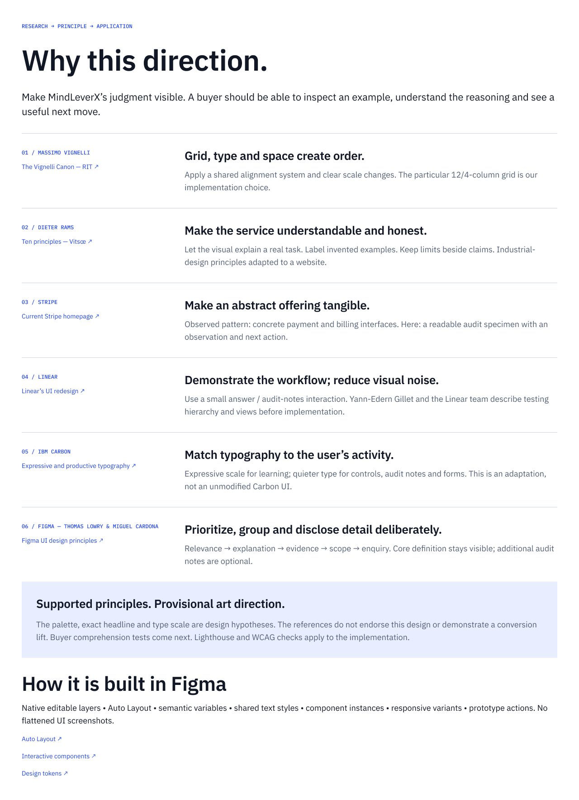

# MindLeverX — Evidence in View concept

[Editable Figma file](https://www.figma.com/design/n3nwpdh6OMrqJNSdm9R3od)

This is the current proposed reimagining, preserved for handoff. It has not been implemented on the website or validated with buyers. The original website-reference Figma file remains separate.

- [Rationale and specific sources](mindleverx-design-rationale.md)
- [Desktop frame](https://www.figma.com/design/n3nwpdh6OMrqJNSdm9R3od?node-id=5-165)
- [Mobile frame](https://www.figma.com/design/n3nwpdh6OMrqJNSdm9R3od?node-id=5-315)
- [Source-to-decision board](https://www.figma.com/design/n3nwpdh6OMrqJNSdm9R3od?node-id=7-53)

The Figma file holds native editable elements. These PNGs are review previews, not an editable `.fig` backup. The original Figma file must remain accessible for implementation.

## Hero preview

## Complete desktop and mobile previews

## Rationale board

